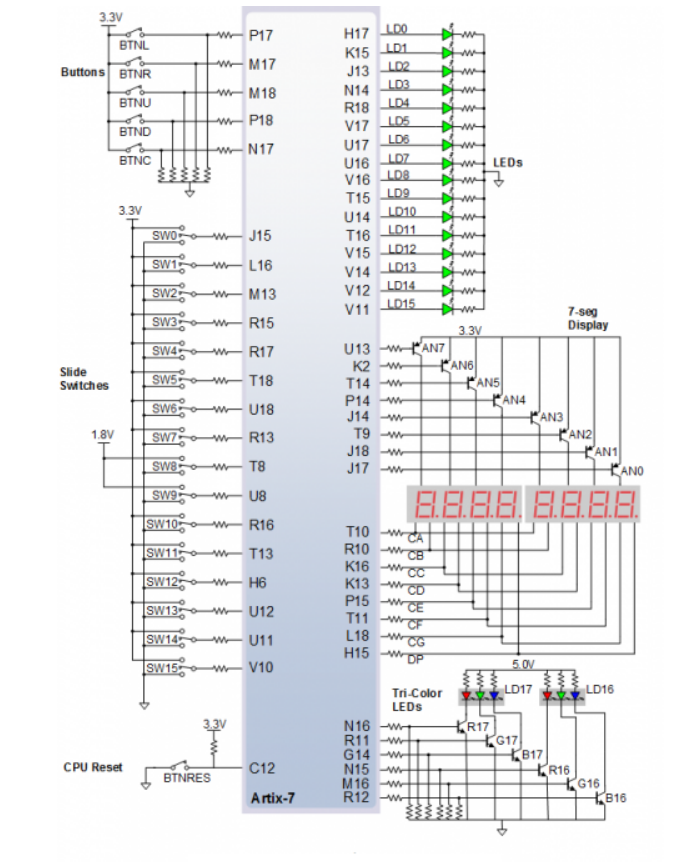

# Digital-electronics-1
https://github.com/xdubra/Digitalelectronics-1
# Lab 03-Introduction to Vivado
## connection of 16 slide switches and 16 LEDs on Nexys A7 board



| LED | Connection | Switch | Connection | 
| :-: | :-: | :-: | :-: |
| LED0 | H17 | SW0 | J15 |
| LED1 | K15 | SW1 | L16 |
| LED2 | J13 | SW2 | M13 |
| LED3 | N14 | SW3 | R15 |
| LED4 | R18 | SW4 | R17 |
| LED5 | V17 | SW5 | T18 |
| LED6 | U17 | SW6 | U18 |
| LED7 | U16 | SW7 | R13 |
| LED8 | V16 | SW8 | T8 |
| LED9 | T15 | SW9 | U8 |
| LED10 | U14 | SW10 | R16 |
| LED11 | T16 | SW11 | T13 |
| LED12 | V15 | SW12 | H6 |
| LED13 | V14 | SW13 | U12 |
| LED14 | V12 | SW14 | U11 |
| LED15 | V11 | SW15 | V10 |

## Two-bit wide 4-to-1 multiplexer
### VHDL architecture

```vhdl
architecture Behavioral of mux_2bit_4to1 is
begin
    
        f_o  <= a_i when (sel_i = "00") else
		b_i when (sel_i = "01") else
		c_i when (sel_i = "10") else
		d_i;
 
end architecture Behavioral;
```
### VHDL stimulus process

```vhdl
   p_stimulus : process
    begin
        -- Report a note at the begining of stimulus process
        report "Stimulus process started" severity note;


        
      s_d <= "00"; s_c <= "00"; s_b <= "00"; s_a <= "00";
        s_sel <= "00"; wait for 50 ns;
        
        s_a <= "01"; wait for 50 ns;
        s_b <= "01"; wait for 50 ns;
        
        s_sel <= "01"; wait for 50 ns;
        s_c <= "00"; wait for 50 ns;
        s_b <= "10"; wait for 50 ns;
        
        s_d <= "10"; s_c <= "11"; s_b <= "01"; s_a <= "00"; 
        s_sel <= "10"; wait for 50 ns;
        
        s_d <= "00"; s_c <= "00"; s_b <= "00"; s_a <= "00"; 
        s_sel <= "10"; wait for 50 ns;
        
        s_d <= "11"; s_c <= "11"; s_b <= "01"; s_a <= "00";
        s_sel <= "11"; wait for 50 ns;
        -- WRITE OTHER TESTS HERE


        -- Report a note at the end of stimulus process
        report "Stimulus process finished" severity note;
        wait;
    end process p_stimulus;

end architecture testbench;
```

### Screenshot with simulated time waveforms


## A Vivado tutorial
### Project creation
1. Otvoríme Vivado 2020.2
2. File > Project > New
3. Klikneme "Next >"
4. Napíšeme názov projektu, zadáme lokáciu uloženia a klikneme "Next>"
5. Necháme zakliknute _RTL Project a klikneme "Next >"

### Adding source file
1. Klikneme "Create File", file type zvolíme "VHDL" a pomenujeme file name, názov musí byt rovnaký ako project name
2. Klikneme "OK" a "Next >"
3. Klikneme "Next >"
4. Klikneme "Boards" a označime napríklad "Nexys A7-50T"
5. Klikneme "Next >"
6. Klikneme "Finish"
7. Klikneme "OK" and "Yes"

### Adding testbench file
1. Pod "Sources", otvoríme "Simulation Sources"
2. Pravim kliknutím na zložku "sim_1" a označime "Add Sources..."
3. Klikneme "Next >"
4. Klikneme "Create File", musí byt "VHDL" a napíšeme názov ktorý ale začina "tb_" 
5. Klikneme "OK"
6. Klikneme "Finish"
7. Klikneme "OK" and "Yes"

### Running simulation
1. V "Simulation" klikneme na "Run Simulation" a klikneme na "Run Behavioral Simultion"
