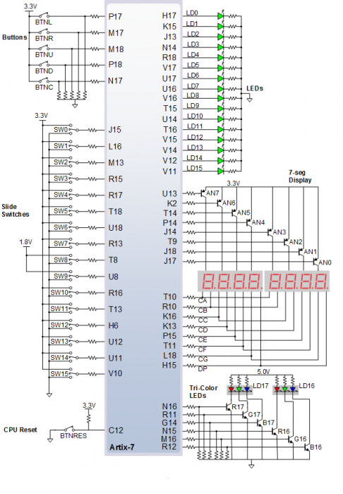
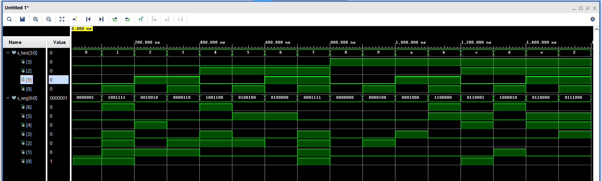
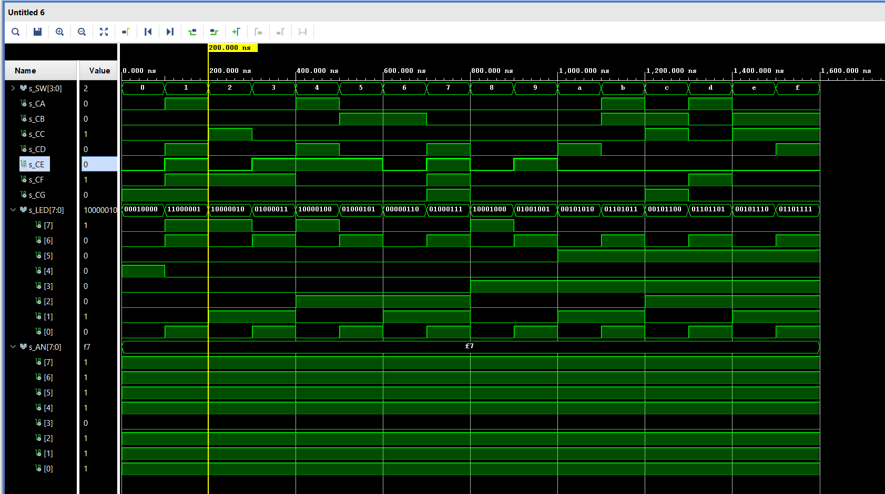

# Digital-electronics-1
https://github.com/xdubra/Digitalelectronics-1
# Lab 04-Seven-segment display decoder
## Connection of 7-segment displays on Nexys A7 board



## Truth table for common anode 7-segment display

| Hex | Inputs | A | B | C | D | E | F | G |
| :-: | :-: | :-: | :-: | :-: | :-: | :-: | :-: | :-: |
| 0 | 0000 | 0 | 0 | 0 | 0 | 0 | 0 | 1 |
| 1 | 0001 | 1 | 0 | 0 | 1 | 1 | 1 | 1 |
| 2 | 0010 | 0 | 0 | 1 | 0 | 0 | 1 | 0 |
| 3 | 0011 | 0 | 0 | 0 | 0 | 1 | 1 | 0 |
| 4 | 0100 | 1 | 0 | 0 | 1 | 1 | 0 | 0 |
| 5 | 0101 | 0 | 1 | 0 | 0 | 1 | 0 | 0 |
| 6 | 0110 | 0 | 1 | 0 | 0 | 0 | 0 | 0 |
| 7 | 0111 | 0 | 0 | 1 | 1 | 1 | 1 | 1 |
| 8 | 1000 | 0 | 0 | 0 | 0 | 0 | 0 | 0 |
| 9 | 1001 | 0 | 0 | 0 | 0 | 1 | 0 | 0 |
| A | 1010 | 0 | 0 | 0 | 1 | 0 | 0 | 0 |
| b | 1011 | 1 | 1 | 0 | 0 | 0 | 0 | 0 |
| C | 1100 | 0 | 1 | 1 | 0 | 0 | 0 | 1 |
| d | 1101 | 1 | 0 | 0 | 0 | 0 | 1 | 0 |
| E | 1110 | 0 | 1 | 1 | 0 | 0 | 0 | 0 |
| F | 1111 | 0 | 1 | 1 | 1 | 0 | 0 | 0 |


## Seven-segment display decoder
### Listing of VHDL architecture from source file ``` hex_7seg.vhd ```
```vhdl

begin
 case hex_i is --Klasický case
            when "0000" =>
                seg_o <= "0000001";     -- 0
            when "0001" =>
                seg_o <= "1001111";     -- 1
            when "0010" =>
                seg_o <= "0010010";     -- 2
            when "0011" =>
                seg_o <= "0000110";     -- 3
            when "0100" =>
                seg_o <= "1001100";     -- 4
            when "0101" =>
                seg_o <= "0100100";     -- 5
            when "0110" =>
                seg_o <= "0100000";     -- 6
            when "0111" =>
                seg_o <= "0001111";     -- 7
            when "1000" =>
                seg_o <= "0000000";     -- 8
            when "1001" =>
                seg_o <= "0000100";     -- 9
            when "1010" =>
                seg_o <= "0001000";     -- A (10)
            when "1011" =>
                seg_o <= "1100000";     -- B (11)
            when "1100" =>
                seg_o <= "0110001";     -- C (12)
            when "1101" =>
                seg_o <= "1000010";     -- D (13)
            when "1110" =>
                seg_o <= "0110000";     -- E (14)
            when others =>
                seg_o <= "0111000";     -- F (15) 
        end case;
    end process p_7seg_decoder;

```
### Listing of VHDL stimulus process from testbench file ``` tb_hex_7seg.vhd ```
```vhdl

begin
    
    uut_hex_7seg : entity work.hex_7seg
        port map(
            hex_i    => s_hex,
            seg_o    => s_seg       
            );
            
            p_stimulus : process
            begin 
                
                report "Stimulus process started" severity note;
                
                
                s_hex <= "0000"; wait for 100ns;

                s_hex <= "0001"; wait for 100ns;
                
                s_hex <= "0010"; wait for 100ns;
                
                s_hex <= "0011"; wait for 100ns;
                
                s_hex <= "0100"; wait for 100ns;
                
                s_hex <= "0101"; wait for 100ns;
                
                s_hex <= "0110"; wait for 100ns;
                
                s_hex <= "0111"; wait for 100ns;
                
                s_hex <= "1000"; wait for 100ns;
                
                s_hex <= "1001"; wait for 100ns;
                
                s_hex <= "1010"; wait for 100ns;
                
                s_hex <= "1011"; wait for 100ns;
                
                s_hex <= "1100"; wait for 100ns;
                
                s_hex <= "1101"; wait for 100ns;
                
                s_hex <= "1110"; wait for 100ns;
                
                s_hex <= "1111"; wait for 100ns;            
            
                report "Stimulus process finished" severity note;
                wait;
                
    end process p_stimulus;
```

### Screenshot with simulated time waveforms



### Listing of VHDL code from source ``` file top.vhd ```
```vhdl
entity top is
    Port ( 
        SW : in STD_LOGIC_VECTOR (4 - 1 downto 0); -- Input binary data
        CA : out STD_LOGIC; -- 	Cathod A
        CB : out STD_LOGIC; -- 	Cathod B
        CC : out STD_LOGIC; -- 	Cathod C
        CD : out STD_LOGIC; -- 	Cathod D
        CE : out STD_LOGIC; -- 	Cathod E
        CF : out STD_LOGIC; -- 	Cathod F
        CG : out STD_LOGIC; -- 	Cathod G
        
        LED : out STD_LOGIC_VECTOR (8 - 1 downto 0); -- LED indicators
        AN  : out STD_LOGIC_VECTOR (8 - 1 downto 0) -- Common anode signals to individual displays
    );
end top;

architecture Behavioral of top is

begin

    --------------------------------------------------------------------
    -- Instance (copy) of hex_7seg entity
    hex2seg : entity work.hex_7seg
        port map(
            hex_i    => SW,
            
            seg_o(6) => CA,
            seg_o(5) => CB,
            seg_o(4) => CC,
            seg_o(3) => CD,
            seg_o(2) => CE,
            seg_o(1) => CF,
            seg_o(0) => CG
        );

    -- Connect one common anode to 3.3V
    AN <= b"1111_0111";
    
    -- Display input value
    LED(3 downto 0) <= SW;
    
    -- Turn LED(4) on if input value is equal to 0, ie "0000"
    LED(4)  <= '1' when (SW = "0000") else '0';
     
    -- Turn LED(5) on if input value is greater than "1001"
    LED(5)  <= '1' when (SW > "1001") else '0';
    
    -- Turn LED(6) on if input value is odd, ie 1, 3, 5, ...
    LED(6)  <= SW(0);
    
    -- Turn LED(7) on if input value is a power of two, ie 1, 2, 4, or 8
    LED(7)  <= '1' when (SW = "0001" or SW = "0010" or SW = "0100" or SW = "1000") else '0';
    
end Behavioral;

```
## LED(7:4) indicators
### Truth table for LEDs(7:4)


| Hex | Inputs | LED4 | LED5 | LED6 | LED7 |
| :-: |   :-:  | :-:  | :-:  | :-:  | :-:  |
|  0  |  0000  |   1  |   0  |   0  |   0  |
|  1  |  0001  |   0  |   0  |   1  |   1  | 
|  2  |  0010  |   0  |   0  |   0  |   1  |
|  3  |  0011  |   0  |   0  |   1  |   0  |
|  4  |  0100  |   0  |   0  |   0  |   1  |
|  5  |  0101  |   0  |   0  |   1  |   0  |
|  6  |  0110  |   0  |   0  |   0  |   0  |
|  7  |  0111  |   0  |   0  |   1  |   0  |
|  8  |  1000  |   0  |   0  |   0  |   1  |
|  9  |  1001  |   0  |   0  |   1  |   0  |
|  A  |  1010  |   0  |   1  |   0  |   0  |
|  b  |  1011  |   0  |   1  |   0  |   0  |
|  C  |  1100  |   0  |   1  |   0  |   0  |
|  d  |  1101  |   0  |   1  |   0  |   0  |
|  E  |  1110  |   0  |   1  |   0  |   0  |
|  F  |  1111  |   0  |   1  |   0  |   0  |


### Listing of VHDL code for LEDs(7:4)
```vhdl
  -- Display input value
    LED(3 downto 0) <= SW;
    
    -- Turn LED(4) on if input value is equal to 0, ie "0000"
    LED(4)  <= '1' when (SW = "0000") else '0';
     
    -- Turn LED(5) on if input value is greater than "1001"
    LED(5)  <= '1' when (SW > "1001") else '0';
    
    -- Turn LED(6) on if input value is odd, ie 1, 3, 5, ...
    LED(6)  <= SW(0);
    
    -- Turn LED(7) on if input value is a power of two, ie 1, 2, 4, or 8
    LED(7)  <= '1' when (SW = "0001" or SW = "0010" or SW = "0100" or SW = "1000") else '0';
```
### Screenshot with simulated time waveforms

