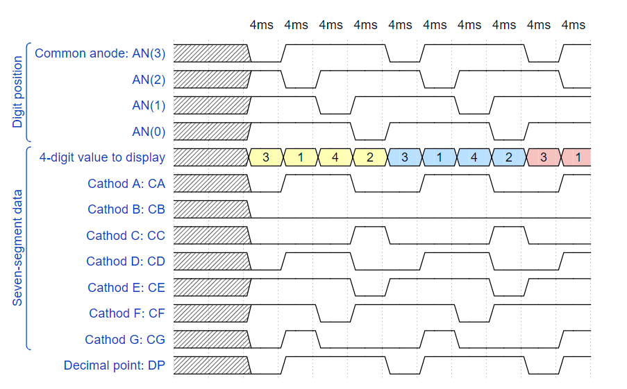

# Digital-electronics-1
https://github.com/xdubra/Digitalelectronics-1
# Lab 6: Driver for multiple seven-segment displays
## Timing diagram figure for displaying value 3.142



```vhdl
{
  signal:
  [
    ['Digit position',
      {name: 'Common anode: AN(3)', wave: 'xx01..01..01'},
      {name: 'AN(2)', wave: 'xx101..01..0'},
      {name: 'AN(1)', wave: 'xx1.01..01..'},
      {name: 'AN(0)', wave: 'xx1..01..01.'},
    ],
    ['Seven-segment data',
      {name: '4-digit value to display', wave: 'xx3333555599', data: ['3','1','4','2','3','1','4','2','3','1']},
      {name: 'Cathod A: CA', wave: 'xx01.0.1.0.1'},
      {name: 'Cathod B: CB', wave: 'xx0.........'},
      {name: 'Cathod C: CC', wave: 'xx0..10..10.'},
      {name: 'Cathod D: CD', wave: 'xx01.0.1.0.1'},
      {name: 'Cathod E: CE', wave: 'xx1..01..01.'},
      {name: 'Cathod F: CF', wave: 'xx1.01..01..'},
      {name: 'Cathod G: CG', wave: 'xx010..10..1'},
    ],
    {name: 'Decimal point: DP', wave: 'xx01..01..01'},
  ],
  head:
  {
    text: '                    4ms   4ms   4ms   4ms   4ms   4ms   4ms   4ms   4ms   4ms',
  },
}
```
## Display driver
### Listing of VHDL code of the process ``` p_mux ```
```vhdl
 p_mux : process(s_cnt, data0_i, data1_i, data2_i, data3_i, dp_i)
    begin
        case s_cnt is
            when "11" =>
                s_hex <= data3_i;
                dp_o  <= dp_i(3);
                dig_o <= "0111";

            when "10" =>
                s_hex <= data2_i;
                dp_o  <= dp_i(2);
                dig_o <= "1011";

            when "01" =>
                s_hex <= data1_i;
                dp_o  <= dp_i(1);
                dig_o <= "1101";

            when others =>
                s_hex <= data0_i;
                dp_o  <= dp_i(0);
                dig_o <= "1110";
                
        end case;
    end process p_mux;
```

### Listing of VHDL testbench file ``` tb_driver_7seg_4digits ```
### Screenshot with simulated time waveforms
### Listing of VHDL architecture of the top layer

## Eight-digit driver
### Image of the driver schematic


