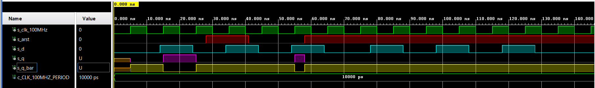
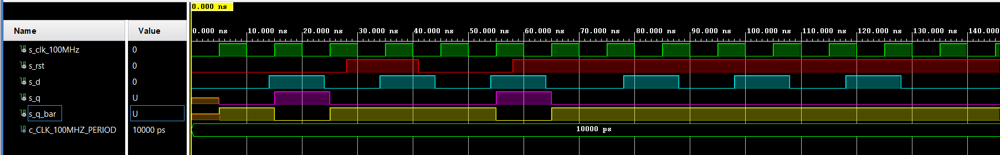
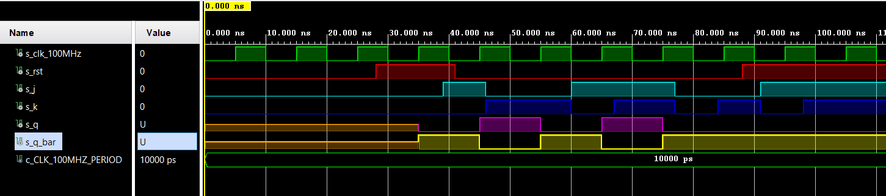
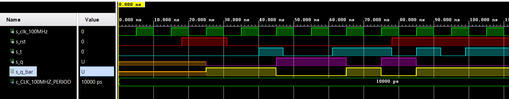

# Digital-electronics-1
https://github.com/xdubra/Digitalelectronics-1
# Lab 7: Latches and Flip-flops

## Characteristic equations and completed tables for D, JK, T flip-flops

<a href="https://www.codecogs.com/eqnedit.php?latex=\dpi{120}&space;\begin{align*}&space;q_{n&plus;1}^{D}&space;=&space;&~&space;d&space;&\\&space;q_{n&plus;1}^{JK}&space;=&~&space;j\overline{q}_{n}\&space;&plus;\overline{k}\,q_{n}&space;&\\&space;q_{n&plus;1}^{T}&space;=&space;&~&space;t\overline{q}_{n}\&space;&plus;\overline{t}\,q_{n}&space;\end{align*}" target="_blank"></a>

| D | Qn | Q(n+1) | Comments |
   | :-: | :-: | :-: | :-- |
   | 0 | 0 | 0 | No change |
   | 0 | 1 | 0 | Invert |
   | 1 | 0 | 1 | Invert |
   | 1 | 1 | 1 | No change |

   | J | K | Qn | Q(n+1) | Comments |
   | :-: | :-: | :-: | :-: | :-- |
   | 0 | 0 | 0 | 0 | No change |
   | 0 | 0 | 1 | 1 | No change |
   | 0 | 1 | 0 | 0 | Reset |
   | 0 | 1 | 1 | 0 | Reset |
   | 1 | 0 | 0 | 1 | Set |
   | 1 | 0 | 1 | 1 | Set |
   | 1 | 1 | 0 | 1 | Toggle |
   | 1 | 1 | 1 | 0 | Toggle |

   | T | Qn | Q(n+1) | Comments |
   | :-: | :-: | :-: | :-- |
   | 0 | 0 | 0 | No change |
   | 0 | 1 | 1 | No change |
   | 1 | 0 | 1 | Invert |
   | 1 | 1 | 0 | Invert |

## D latch
### VHDL code listing of the process ``` p_d_latch ```
```vhdl

p_d_latch : process (d, arst, en)
begin
    if (arst = '1') then
        q <= '0';
        q_bar <= '1';
            
   elsif
      (en = '1') then
        q <= d;
        q_bar <= not d;
    end if;
end process p_d_latch;

```

### Listing of VHDL reset and stimulus processes from the testbench ``` tb_d_latch.vhd ```
```vhdl
 p_reset_gen : process
     begin
         s_arst <= '0';
         wait for 38 ns;
         
         -- Reset activated
         s_arst <= '1';
         wait for 53 ns;

         --Reset deactivated
         s_arst <= '0';
        
         wait for 80 ns;
         s_arst <= '1';

         wait;
     end process p_reset_gen;

    --------------------------------------------------------------------
    -- Data generation process
    --------------------------------------------------------------------
    p_stimulus : process
    begin
        report "Stimulus process started" severity note;
        
        s_d  <= '0';
        s_en <= '0';
        
        --d sekv
        wait for 10 ns;
        s_d  <= '1';
        wait for 10 ns;
        s_d  <= '0';
        wait for 10 ns;
        s_d  <= '1';
        wait for 10 ns;
        s_d  <= '0';
        wait for 5 ns;
        
        assert ((s_arst = '1') and (s_en = '0') and (s_q = '0') and (s_q_bar = '1'))
        report "Test failed for reset high, en low when s_d = '0'" severity error;
        
        wait for 5 ns;
        s_d  <= '1';
        wait for 5 ns;
        
        assert ((s_arst = '1') and (s_en = '0') and (s_q = '0') and (s_q_bar = '1'))
        report "Test failed for reset high, en low when s_d = '1'" severity error;
        
        wait for 5 ns;
        s_d  <= '0';
        --/d sekv
        
        s_en <= '1';
        
        --d sekv
        wait for 10 ns;
        s_d  <= '1';
        wait for 5 ns;
        
        assert ((s_arst = '1') and (s_en = '1') and (s_q = '0') and (s_q_bar = '1'))
        report "Test failed for reset high, en high when s_d = '1'" severity error;
        
        wait for 5 ns;
        s_d  <= '0';
        wait for 5 ns;
        
        assert ((s_arst = '1') and (s_en = '1') and (s_q = '0') and (s_q_bar = '1'))
        report "Test failed for reset high, en high when s_d = '0'" severity error;          
        
        wait for 5 ns;
        s_d  <= '1';
        wait for 10 ns;
        s_d  <= '0';
        wait for 10 ns;
        s_d  <= '1';
        wait for 5 ns;
        
        assert ((s_arst = '0') and (s_en = '1') and (s_q = '1') and (s_q_bar = '0'))
        report "Test failed for reset low, en high when s_d = '1'" severity error;
        
        wait for 15 ns;
        s_d  <= '0';
        wait for 5 ns;
        
        assert ((s_arst = '0') and (s_en = '1') and (s_q = '0') and (s_q_bar = '1'))
        report "Test failed for reset low, en high when s_d = '0'" severity error;
        
        --/d sekv
        
        --d sekv
        wait for 5 ns;
        s_d  <= '1';
        wait for 5 ns;
        s_en <= '0';
        wait for 5 ns;
        s_d  <= '0';
   
        wait for 10 ns;
        s_d  <= '1';
        wait for 10 ns;
        s_d  <= '0';
        wait for 10 ns;
        s_d  <= '1';
        wait for 10 ns;
        s_d  <= '0';
        --/d sekv
        
        
    
        report "Stimulus process finished" severity note;
        wait;
    end process p_stimulus;
```
### Screenshot with simulated time waveforms


## Flip-flops
### VHDL code listing of the processes p_d_ff_arst, p_d_ff_rst, p_jk_ff_rst, p_t_ff_rst
#### p_d_ff_arst
```vhdl
p_d_latch : process (clk, arst)
begin
    if (arst = '1') then
        q <= '0';
        q_bar <= '1';
            
   elsif
      rising_edge(clk) then
        q <= d;
        q_bar <= not d;
    end if;
end process p_d_latch;
```
#### p_d_ff_rst
```vhdl

```
#### p_jk_ff_rst
```vhdl

```
#### p_t_ff_rst
```vhdl

```
### Listing of VHDL clock, reset and stimulus processes from the testbench files
#### tb_d_ff_arst
```vhdl
p_reset_gen : process
        begin
            s_arst <= '0';
            wait for 28 ns;
            
            -- Reset activated
            s_arst <= '1';
            wait for 13 ns;
    
            --Reset deactivated
            s_arst <= '0';
            
            wait for 17 ns;
            
            s_arst <= '1';
            wait for 33 ns;
            
            wait for 660 ns;
            s_arst <= '1';
    
            wait;
     end process p_reset_gen;

    --------------------------------------------------------------------
    -- Data generation process
    --------------------------------------------------------------------
    p_stimulus : process
    begin
        report "Stimulus process started" severity note;
        
        s_d  <= '0';
        
        --d sekv
        wait for 14 ns;
        s_d  <= '1';
        wait for 2 ns;
        
        assert ((s_arst = '0') and (s_q = '1') and (s_q_bar = '0'))
        report "Test failed for reset low, after clk rising when s_d = '1'" severity error;
        
        wait for 8 ns;
        s_d  <= '0';
        wait for 6 ns;
        
        --assert()
        --report "";
        
        wait for 4 ns;
        s_d  <= '1';
        wait for 10 ns;
        s_d  <= '0';
        wait for 10 ns;
        s_d  <= '1';
        wait for 5 ns;
        
        -- verify that reset is truly asynchronous
        assert ((s_arst = '1') and (s_q = '0') and (s_q_bar = '1'))
        report "Test failed for reset high, before clk rising when s_d = '1'" severity error;
        
        wait for 5 ns;
        s_d  <= '0';
        --/d sekv
        
        --d sekv
        wait for 14 ns;
        s_d  <= '1';
        wait for 10 ns;
        s_d  <= '0';
        wait for 10 ns;
        s_d  <= '1';
        wait for 10 ns;
        s_d  <= '0';
        wait for 10 ns;
        s_d  <= '1';
        wait for 10 ns;
        s_d  <= '0';
        --/d sekv
        
       
        report "Stimulus process finished" severity note;
        wait;
    end process p_stimulus;
```
#### tb_d_ff_rst
```vhdl

```
#### tb_jk_ff_rst
```vhdl

```
#### tb_t_ff_rst
```vhdl

```
### Screenshot with simulated time waveforms
#### p_d_ff_arst

#### p_d_ff_rst


#### p_jk_ff_rst


#### p_t_ff_rst



## Shift register
### Image of the shift register schematic


