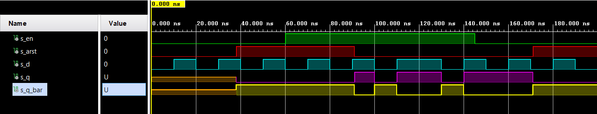

# Digital-electronics-1
https://github.com/xdubra/Digitalelectronics-1
# Lab 7: Latches and Flip-flops
## Timing diagram figure for displaying value 3.142

## Characteristic equations and completed tables for D, JK, T flip-flops

<a href="https://www.codecogs.com/eqnedit.php?latex=\dpi{120}&space;\begin{align*}&space;q_{n&plus;1}^{D}&space;=&space;&~&space;d&space;&\\&space;q_{n&plus;1}^{JK}&space;=&~&space;j\overline{q}_{n}\&space;&plus;\overline{k}\,q_{n}&space;&\\&space;q_{n&plus;1}^{T}&space;=&space;&~&space;t\overline{q}_{n}\&space;&plus;\overline{t}\,q_{n}&space;\end{align*}" target="_blank"></a>

| D | Qn | Q(n+1) | Comments |
   | :-: | :-: | :-: | :-- |
   | 0 | 0 | 0 | No change |
   | 0 | 1 | 0 | Invert |
   | 1 | 0 | 1 | Invert |
   | 1 | 1 | 1 | No change |

   | J | K | Qn | Q(n+1) | Comments |
   | :-: | :-: | :-: | :-: | :-- |
   | 0 | 0 | 0 | 0 | No change |
   | 0 | 0 | 1 | 1 | No change |
   | 0 | 1 | 0 | 0 | Reset |
   | 0 | 1 | 1 | 0 | Reset |
   | 1 | 0 | 0 | 1 | Set |
   | 1 | 0 | 1 | 1 | Set |
   | 1 | 1 | 0 | 1 | Toggle |
   | 1 | 1 | 1 | 0 | Toggle |

   | T | Qn | Q(n+1) | Comments |
   | :-: | :-: | :-: | :-- |
   | 0 | 0 | 0 | No change |
   | 0 | 1 | 1 | No change |
   | 1 | 0 | 1 | Invert |
   | 1 | 1 | 0 | Invert |

## D latch
### VHDL code listing of the process ``` p_d_latch ```
```vhdl
architecture Behavioral of d_latch is
begin
p_d_latch : process (d, arst, en)
begin
    if (arst = '1') then
        q <= '0';
        q_bar <= '1';
            
   elsif
      (en = '1') then
        q <= d;
        q_bar <= not d;
    end if;
end process p_d_latch;

end Behavioral;
```

### Listing of VHDL reset and stimulus processes from the testbench ``` tb_d_latch.vhd ```
```vhdl
```



