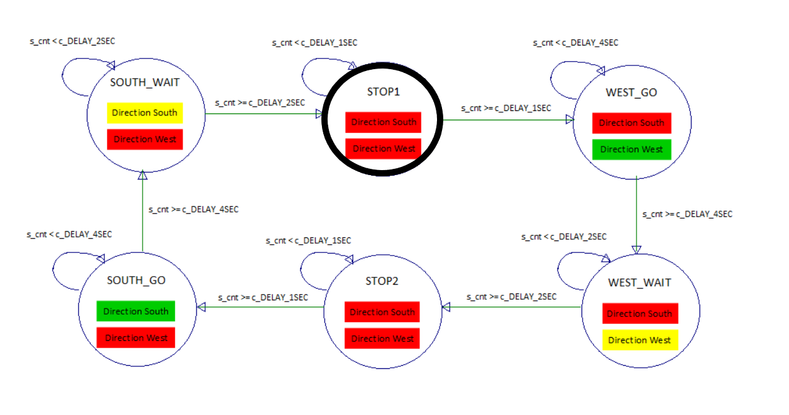

# Digital-electronics-1
https://github.com/xdubra/Digitalelectronics-1
# Lab 8: Traffic light controller

## Completed state table

| **Input P** | `0` | `0` | `1` | `1` | `0` | `1` | `0` | `1` | `1` | `1` | `1` | `0` | `0` | `1` | `1` | `1` |
| :-- | :-: | :-: | :-: | :-: | :-: | :-: | :-: | :-: | :-: | :-: | :-: | :-: | :-: | :-: | :-: | :-: |
| **Clock** |  |  |  |  |  |  |  |  |  |  |  |  |  |  |  |  |
| **State** | A |  |  |  |  |  |  |  |  |  |  |  |  |  |  |  |
| **Output R** | `0` |  |  |  |  |  |  |  |  |  |  |  |  |  |  |  |


## Figure with connection of RGB LEDs on Nexys A7 board and completed table with color settings


| **RGB LED** | **Artix-7 pin names** | **Red** | **Yellow** | **Green** |
| :-: | :-: | :-: | :-: | :-: |
| LD16 | N15, M16, R12 | `1,0,0` | `1,1,0` | `0,1,0` |
| LD17 | N16, R11, G14 | `1,0,0` | `1,1,0` | `0,1,0` |


## Traffic light controller
### State diagram



### Listing of VHDL code of sequential process  ``` p_traffic_fsm ```
```vhdl
 p_traffic_fsm : process(clk)
    begin
        if rising_edge(clk) then
            if (reset = '1') then       -- Synchronous reset
                s_state <= STOP1 ;      -- Set initial state
                s_cnt   <= c_ZERO;      -- Clear all bits

            elsif (s_en = '1') then
                -- Every 250 ms, CASE checks the value of the s_state 
                -- variable and changes to the next state according 
                -- to the delay value.
                case s_state is

                  
                    when STOP1 =>           
                        if (s_cnt < c_DELAY_1SEC) then
                            s_cnt <= s_cnt + 1;
                        else
                            -- Move to the next state
                            s_state <= WEST_GO;
                            -- Reset local counter value
                            s_cnt   <= c_ZERO;
                        end if;

                    when WEST_GO =>                    
                        if (s_cnt < c_DELAY_4SEC) then
                            s_cnt <= s_cnt + 1;
                        else
                            -- Move to the next state
                            s_state <= WEST_WAIT;
                            -- Reset local counter value
                            s_cnt   <= c_ZERO;
                        end if;
                        
                    when WEST_WAIT =>                    
                        if (s_cnt < c_DELAY_2SEC) then
                            s_cnt <= s_cnt + 1;
                        else
                            -- Move to the next state
                            s_state <= STOP2;
                            -- Reset local counter value
                            s_cnt   <= c_ZERO;
                        end if;

                    when STOP2 =>
                        if (s_cnt < c_DELAY_1SEC) then
                            s_cnt <= s_cnt + 1;
                        else
                            -- Move to the next state
                            s_state <= SOUTH_GO;
                            -- Reset local counter value
                            s_cnt   <= c_ZERO;
                        end if;

                    when SOUTH_GO =>
                        if (s_cnt < c_DELAY_4SEC) then
                            s_cnt <= s_cnt + 1;
                        else
                            -- Move to the next state
                            s_state <= SOUTH_WAIT;
                            -- Reset local counter value
                            s_cnt   <= c_ZERO;
                        end if;
                        
                    when SOUTH_WAIT =>
                        if (s_cnt < c_DELAY_2SEC) then
                            s_cnt <= s_cnt + 1;
                        else
                            -- Move to the next state
                            s_state <= STOP1;
                            -- Reset local counter value
                            s_cnt   <= c_ZERO;
                        end if;

                    -- It is a good programming practice to use the 
                    -- OTHERS clause, even if all CASE choices have 
                    -- been made. 
                    when others =>
                        s_state <= STOP1;

                end case;
            end if; -- Synchronous reset
        end if; -- Rising edge
    end process p_traffic_fsm;


```
### Listing of VHDL code of combinatorial process  ``` p_output_fsm ```
```vhdl
 p_output_fsm : process(s_state)
    begin
        case s_state is
            when STOP1 =>
                south_o <= "100";   -- Red (RGB = 100)
                west_o  <= "100";   -- Red (RGB = 100)
                
            when WEST_GO =>
                south_o <= "100";   -- Red (RGB = 100)
                west_o  <= "010";   -- GREEN (RGB = 010)
                
            when WEST_WAIT =>
                south_o <= "100";   -- Red (RGB = 100)
                west_o  <= "110";   -- YELLOW (RGB = 110)
                
            when STOP2 =>
                south_o <= "100";   -- Red (RGB = 100)
                west_o  <= "100";   -- Red (RGB = 100)
                
            when SOUTH_GO =>
                south_o <= "010";   -- GREEN (RGB = 010)
                west_o  <= "100";   -- Red (RGB = 100)
                
            when SOUTH_WAIT =>
                south_o <= "110";   -- YELLOW (RGB = 110)
                west_o  <= "100";   -- Red (RGB = 100)
            when others =>
                south_o <= "100";   -- Red
                west_o  <= "100";   -- Red
        end case;
    end process p_output_fsm;
```

### Screenshots of the simulation


