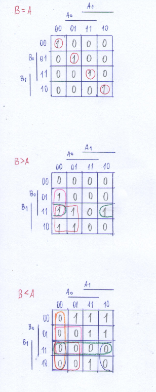

# Digital-electronics-1
https://github.com/xdubra/Digitalelectronics-1
# Lab 02-logic
## 2-bit comparator truth table

| **Dec. equivalent** | **B[1:0]** | **A[1:0]** | **B is greater than A** | **B equals A** | **B is less than A** |
| :-: | :-: | :-: | :-: | :-: | :-: |
| 0 | 0 0 | 0 0 | 0 | 1 | 0 |
| 1 | 0 0 | 0 1 | 0 | 0 | 1 |
| 2 | 0 0 | 1 0 | 0 | 0 | 1 |
| 3 | 0 0 | 1 1 | 0 | 0 | 1 |
| 4 | 0 1 | 0 0 | 1 | 0 | 0 |
| 5 | 0 1 | 0 1 | 0 | 1 | 0 |
| 6 | 0 1 | 1 0 | 0 | 0 | 1 |
| 7 | 0 1 | 1 1 | 0 | 0 | 1 |
| 8 | 1 0 | 0 0 | 1 | 0 | 0 |
| 9 | 1 0 | 0 1 | 1 | 0 | 0 |
| 10 | 1 0 | 1 0 | 0 | 1 | 0 |
| 11 | 1 0 | 1 1 | 0 | 0 | 1 |
| 12 | 1 1 | 0 0 | 1 | 0 | 0 |
| 13 | 1 1 | 0 1 | 1 | 0 | 0 |
| 14 | 1 1 | 1 0 | 1 | 0 | 0 |
| 15 | 1 1 | 1 1 | 0 | 1 | 0 |


<a href="https://www.codecogs.com/eqnedit.php?latex=\dpi{120}&space;\begin{align*}&space;f(b<a)&space;=&~&space;(\&space;{b{1}}\&space;&plus;&space;{b{0}}\&space;&plus;&space;\&space;{a{1}}\&space;&plus;&space;{a{0}})&space;\cdot&space;\&space;(\&space;{b{1}}\&space;&plus;&space;\overline{b{0}}\&space;&plus;&space;\&space;{a{1}}\&space;&plus;&space;{a{0}})&space;\cdot&space;\&space;(\&space;{b{1}}\&space;\cdot&space;\overline{b{0}}\&space;\cdot&space;\&space;{a{1}}\&space;\cdot&space;\overline{a{0}})&space;\cdot&space;\&space;(\overline{b{1}}\&space;&plus;&space;\&space;{b{0}}\&space;&plus;&space;\&space;{a{1}}\&space;&plus;&space;\&space;{a{0}})&space;\cdot&space;\&space;(\overline{b{1}}\&space;&plus;&space;\&space;{b{0}}\&space;&plus;&space;\&space;{a{1}}\&space;&plus;&space;\overline{a{0}})&space;\cdot&space;\&space;(\overline{b{1}}\&space;&plus;&space;\&space;{b{0}}\&space;&plus;&space;\overline{a{1}}\&space;&plus;&space;\&space;{a{0}})&space;\cdot&space;\&space;(\overline{b{1}}\&space;&plus;&space;\overline{b{0}}\&space;&plus;&space;\&space;{a{1}}\&space;&plus;&space;\overline{a{0}})&space;\cdot&space;\&space;(\overline{b{1}}\&space;&plus;&space;\overline{b{0}}\&space;&plus;&space;\&space;{a{1}}\&space;&plus;&space;\&space;{a{0}})&space;\cdot&space;\&space;(\overline{b{1}}\&space;&plus;&space;\overline{b{0}}\&space;&plus;&space;\overline{a{1}}\&space;&plus;&space;\&space;{a{0}})&space;\cdot&space;\&space;(\overline{b{1}}\&space;&plus;&space;\overline{b{0}}\&space;&plus;&space;\overline{a{1}}\&space;&plus;&space;\overline{a{0}})&space;\end{align*}" target="_blank"></a>

<a href="https://www.codecogs.com/eqnedit.php?latex=\begin{align*}&space;f(b=a)&space;=&~&space;(\overline{b{1}}\&space;\cdot&space;\overline{b{0}}\&space;\cdot&space;\overline{a{1}}\&space;\cdot&space;\overline{a{0}})&space;&plus;&space;(\overline{b{1}}\&space;\cdot&space;\&space;{b{0}}\&space;\cdot&space;\overline{a{1}}\&space;\cdot&space;\&space;{a{0}})&plus;&space;(\&space;{b{1}}\&space;\cdot&space;\overline{b{0}}\&space;\cdot&space;\&space;{a{1}}\&space;\cdot&space;\overline{a{0}})&plus;&space;(\&space;{b{1}}\&space;\cdot&space;\&space;{b{0}}\&space;\cdot&space;\&space;{a{1}}\&space;\cdot&space;\&space;{a{0}})&space;\end{align*}" target="_blank"></a>

## Karnaugh maps for all three functions


<a href="https://www.codecogs.com/eqnedit.php?latex=\begin{align*}&space;f(B>A)&space;=&~&space;(\&space;{B{1}}\&space;\cdot&space;\overline{A{1}}\&space;)&space;&plus;&space;(\&space;{B{1}}\&space;\cdot&space;\&space;{B{0}}\&space;\cdot&space;\overline{A{0}})&plus;&space;{B{0}}&space;\\&space;f(B<A)&space;=&~&space;(\overline{B{0}}\&space;&plus;&space;\&space;{A{1}})&space;\cdot&space;\&space;(\overline{B{1}}\&space;&plus;&space;\&space;{A{1}})&space;\cdot&space;\&space;(\overline{B{1}}\&space;&plus;&space;\overline{B{0}})&space;\cdot&space;\&space;(\&space;{A{1}}\&space;&plus;&space;\&space;{A{0}})&space;\cdot&space;\&space;(\overline{B{1}}\&space;&plus;&space;\&space;{A{0}})&space;\end{align*}" target="_blank">A)&space;=&~&space;(\&space;{B{1}}\&space;\cdot&space;\overline{A{1}}\&space;)&space;&plus;&space;(\&space;{B{1}}\&space;\cdot&space;\&space;{B{0}}\&space;\cdot&space;\overline{A{0}})&plus;&space;{B{0}}&space;\\&space;f(B<A)&space;=&~&space;(\overline{B{0}}\&space;&plus;&space;\&space;{A{1}})&space;\cdot&space;\&space;(\overline{B{1}}\&space;&plus;&space;\&space;{A{1}})&space;\cdot&space;\&space;(\overline{B{1}}\&space;&plus;&space;\overline{B{0}})&space;\cdot&space;\&space;(\&space;{A{1}}\&space;&plus;&space;\&space;{A{0}})&space;\cdot&space;\&space;(\overline{B{1}}\&space;&plus;&space;\&space;{A{0}})&space;\end{align*}" title="\begin{align*} f(B>A) =&~ (\ {B{1}}\ \cdot \overline{A{1}}\ ) + (\ {B{1}}\ \cdot \ {B{0}}\ \cdot \overline{A{0}})+ {B{0}} \\ f(B<A) =&~ (\overline{B{0}}\ + \ {A{1}}) \cdot \ (\overline{B{1}}\ + \ {A{1}}) \cdot \ (\overline{B{1}}\ + \overline{B{0}}) \cdot \ (\ {A{1}}\ + \ {A{0}}) \cdot \ (\overline{B{1}}\ + \ {A{0}}) \end{align*}" /></a>

## A 4-bit binary comparator. Submit

### VHDL architecture from design file
```vhdl
library ieee;
use ieee.std_logic_1164.all;
entity comparator_4bit is
    port(
        a_i           : in  std_logic_vector(2 - 1 downto 0);
        b_i           : in  std_logic_vector(4 - 1 downto 0);

        B_greater_A_o    : out    std_logic;
        B_equals_A_o    : out    std_logic;
        B_less_A_o    : out std_logic       -- B is less than A
    );
end entity comparator_4bit;
architecture Behavioral of comparator_4bit is
begin
    B_less_A_o   <= '1' when (b_i < a_i) else '0';
    B_greater_A_o    <= '1' when (b_i > a_i) else '0';
    B_equals_A_o    <= '1' when (b_i = a_i) else '0';

end architecture Behavioral;
```
### VHDL stimulus process from testbench file